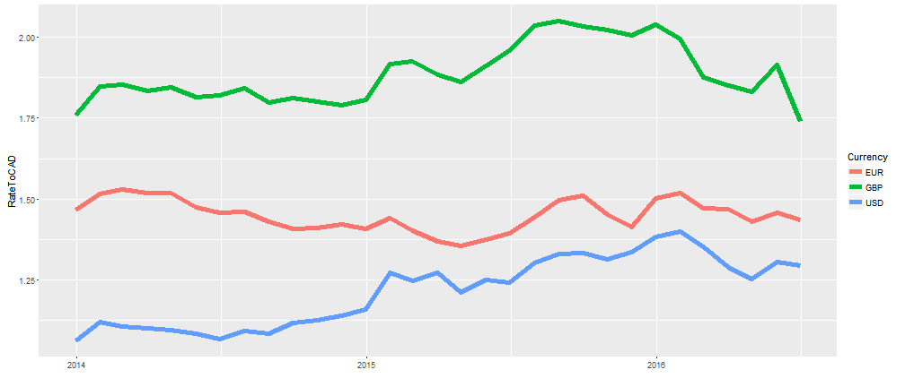
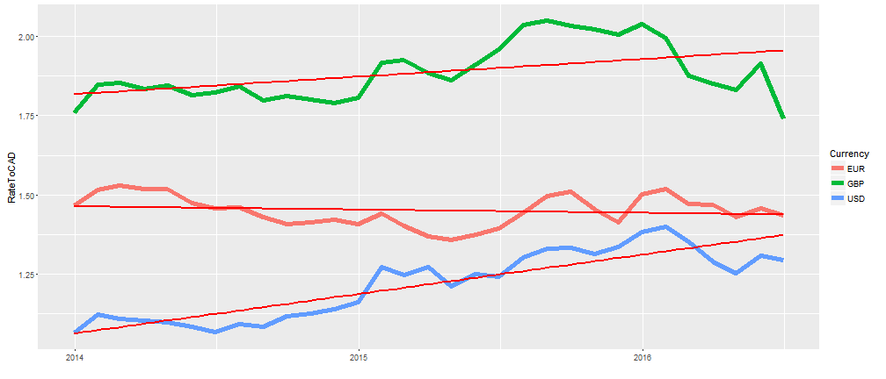
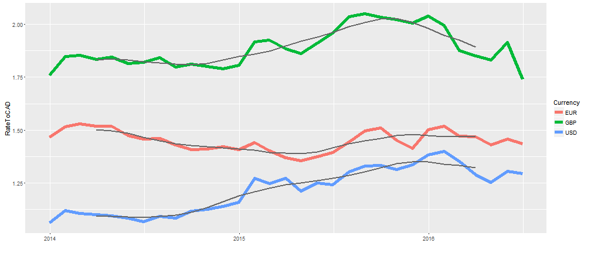
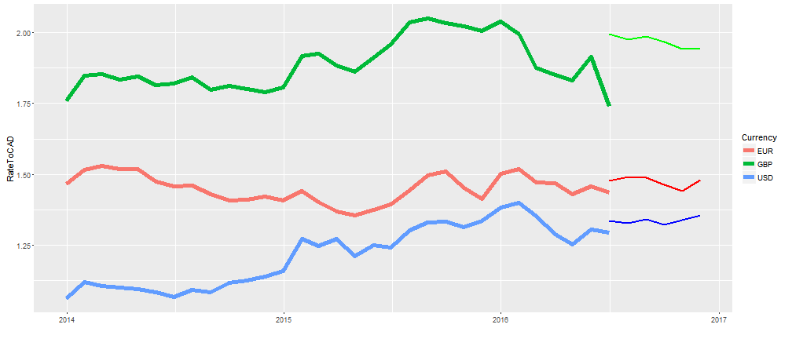

## Description

This app displays the past 2.5 years of exchange rates to the Canadian dollar from the Euro, Great Britain Pound and US dollar as shown here. R Markdown code showing calculations can be found on [Github] (https://github.com/graeme-j/DataProducts/tree/gh-pages)

--- .class #id 

## Trends

An option to display a trendline is available to the user to get a better visual of what the trend over the last 2.5 years was. This helps the user get a better idea of the long term trend of the exchange rate as shown here.

--- .class #id

## Moving Average

A moving average option is also included. The user can change the window of the moving average from 2 months to 7 months. This allows the user to get a sense of moving trends rather than the overall trend. A 6 month moving average trend is shown here.

--- .class #id

## Forecast

A 6 month forecast option is also available to the user. This allows the user to view what a very basic 6 month forecast for each exchange rate looks like. This might help the user decide if it a good time to buy or sell a specific currency. (Note that the forecast is very basic and should not be used)

